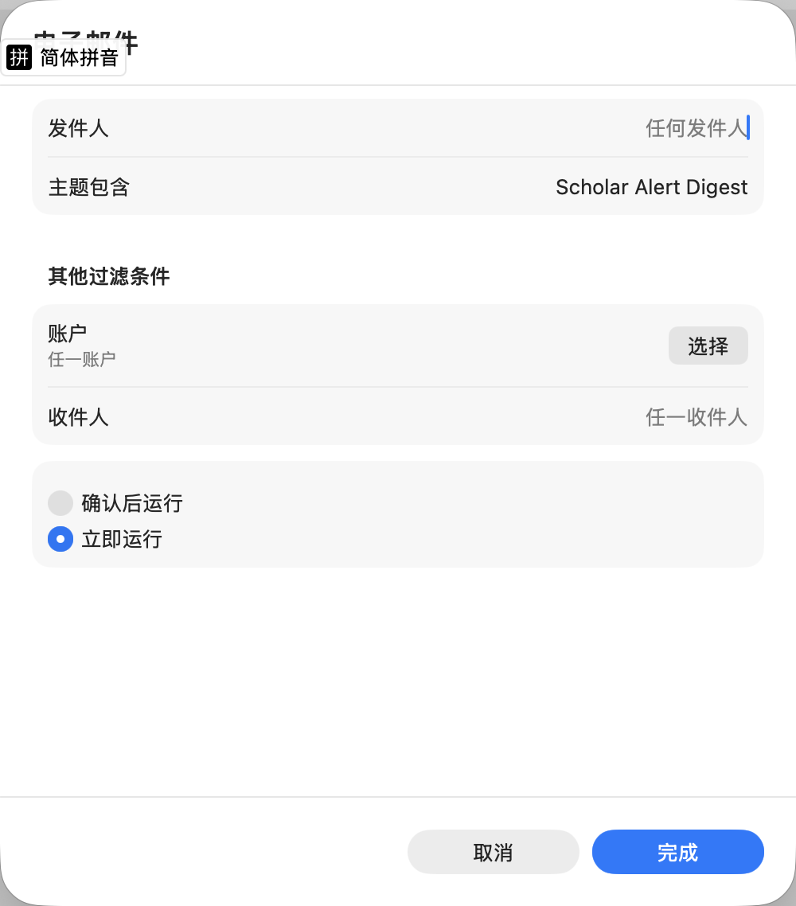
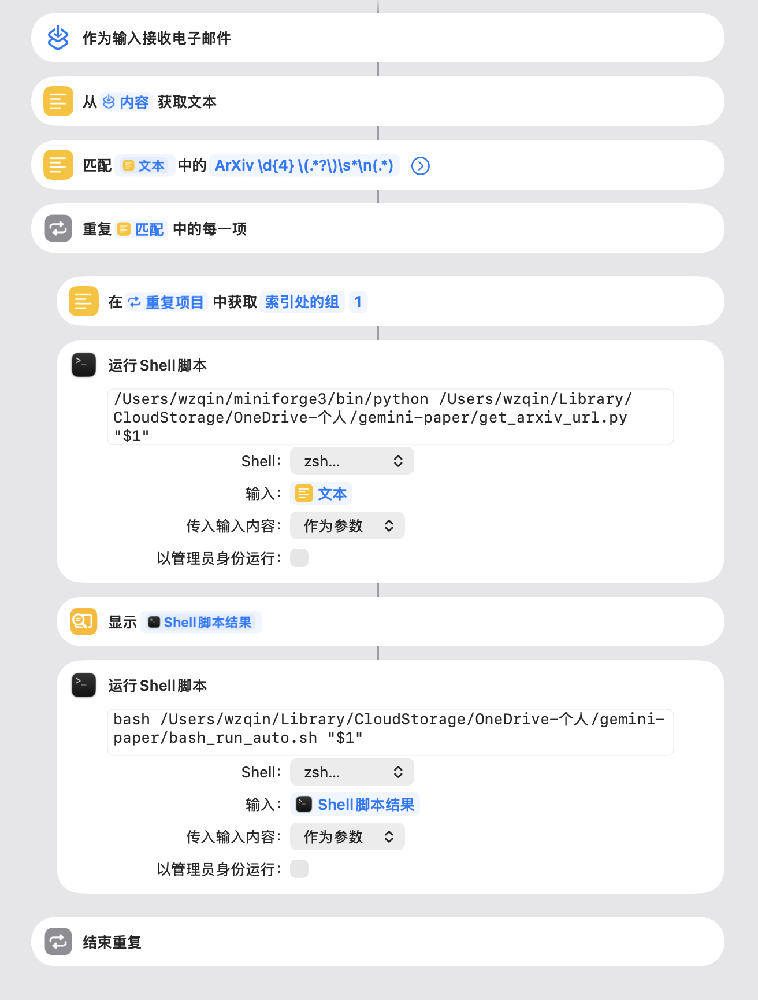

# 🤖 Auto-Paper-Explainer: 自动化论文阅读与总结流水线

[English](README.md) | [中文](README_ZH.md)

这是一个基于 macOS 快捷指令 (Apple Shortcuts) 和 Google Gemini CLI 构建的自动化学术论文处理工作流。

它可以实现：**“接收 Inbox 邮件订阅 -> 自动提取论文标题 -> 爬取 ArXiv PDF -> 呼叫大模型精读 -> 生成带架构图的本地 Markdown 笔记” 的全自动闭环。**

适用于：**想每天快速浏览最新的paper，但是简单的摘要还不太够看；拥有Inbox推送，但是每天稍微精读4-5篇论文时间还不够；注册了gemini pro，但是又觉得claude code api太贵的童鞋们**

## ✨ 核心特性
* 📧 邮件自动触发：利用 macOS 快捷指令，自动监听特定主题的邮件（如 Scholar Alert Digest）。

* 🕷️ 智能信息抓取：通过正则表达式提取论文标题，并配合 Python 脚本自动去 arXiv 检索并获取 PDF 直链。

* 🧠 深度结构化总结：基于定制的 Gemini Prompt (Skill)，不仅生成 TL;DR，还会深度剖析模型架构、实验结论，甚至使用 Mermaid.js 自动绘制网络结构图。

* 📂 本地批量处理：除了邮件自动化，还提供独立的 Shell 脚本，支持对本地单个 PDF 或整个文件夹内的 PDF 进行批量解析。


## 🛠️ 前置要求
在运行此工作流之前，请确保你的 Mac 已经安装并配置好以下环境：

* 拥有MacSO的设备，可以使用快捷指令功能。

* Python 3：需安装 requests 和 beautifulsoup4（用于抓取 arXiv 链接）。
    ```bash
    pip install requests beautifulsoup4
    ```

* Gemini CLI：需要安装官方或第三方的 Gemini 命令行工具，并完成配置。
    ```bash
    brew install gemini-cli
    brew install poppler
    gemini
    ```

* [Scholar-Inbox](https://www.scholar-inbox.com/) 注册，并更新相关的preferences，同时打开订阅邮件权限


## 🚀 使用指南
### 1. Clone仓库
```bash
git clone https://github.com/wz7in/auto-paper-reader.git
```

### 2. 配置快捷指令
1. 打开快捷指令.app，创建自动化，选择“接收邮件”作为触发条件，设置过滤条件（如主题包含 "Scholar Alert Digest"）,如下图所示：



2. 在自动化中添加如下快捷指令（注意修改scripts中的路径）：



### 3. 配置gemini-cli skill

```bash
mkdir -p ~/.gemini/skills/paper-explainer
mv SKILL.md ~/.gemini/skills/paper-explainer/
gemini
```

### 4. 修改路径

将bash_run.sh, bash_run_auto.sh以及get_arxiv_url.py中的路径修改为你本地的路径

### 5. Proxy

打开系统代理TUN模式

### 5. 使用方法

* 邮件自动化：每当你收到符合条件的邮件时，快捷指令会自动触发，完成从提取标题到生成笔记的全流程。

* 本地批量处理：你也可以直接运行 bash_run_auto.sh 脚本，对指定文件夹内的 PDF 进行批量处理。
```bash
bash bash_run.sh /path/to/your/pdf/folder
```
* 单个文件处理：如果你只想处理单个 PDF，可以运行 bash_run.sh 脚本，传入 PDF 路径。
```bash
bash bash_run.sh /path/to/your/paper.pdf
```
